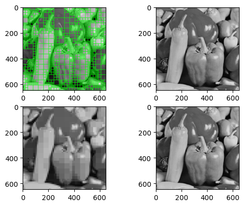

# Split & Merge Image Segmentation

Split & Merge Segmentation is a *region-based* image segmentation technique that combines both top-down and bottom-up approaches. The process begins by recursively splitting the image into four smaller regions based on a homogeneity criterion. Then, when the splitting phase is complete, adjacent regions are merged to form larger homogeneous regions, resulting in the final segmented image.

this project was done as a final assignment for the Signals, Images and Videos course held by professor Rosani at the University of Trento. Read the notebook report.ipynb to learn more about the algorithm.

